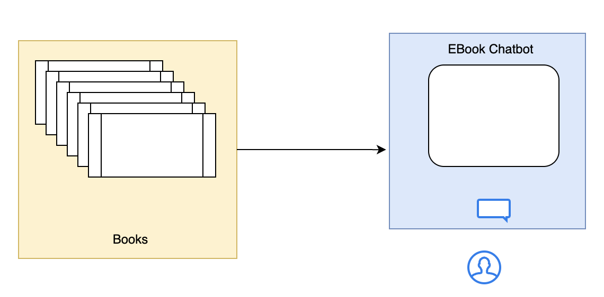

# 🦜 LangChain Overview

LangChain is an open-source framework that helps build applications powered by **Large Language Models (LLMs)**. It provides modular components and end-to-end tools to create powerful AI solutions like:

- Chatbots
- Question-answering systems
- Retrieval-Augmented Generation (RAG)
- Autonomous agents
- And more!

---

## 🚀 Why LangChain?

- ✅ Supports all major LLMs
- ✅ Simplifies building LLM-powered applications
- ✅ Seamless integration with popular tools
- ✅ Open source and actively maintained
- ✅ Suits a wide range of GenAI use cases

- 
---

## 🔍 Search Capabilities

1. **Normal Keyword Search**  
2. **Semantic Search** (understand query & retrieve contextually)

### 🧠 LangChain “Brain” Features:
- Natural Language Understanding (NLU)
- Context-Aware Text Generation

---

## ⚠️ Challenges Before LangChain

- Where to host LLMs?
- How to manage doc uploaders, text splitters, embeddings, retrieval?
- Can you build and maintain these from scratch?
- How to switch models without rewriting everything?

- 
---

## ✅ Benefits of LangChain

- 
- 
- Concept of **Chains** to build logic
- **Model Agnostic** development
- Robust **Ecosystem**
- **Memory and State** handling (e.g., for past conversations)

---

## 🔄 Alternatives

- [LlamaIndex](https://www.llamaindex.ai/)
- [Haystack](https://haystack.deepset.ai/)

---

## 🧩 Core LangChain Components

- 

Types of Memory:
| Component                      | Description                                                                 |
|-------------------------------|-----------------------------------------------------------------------------|
| `ConversationBufferMemory`    | Stores full transcript (can get large)                                      |
| `ConversationBufferWindowMemory` | Keeps last N interactions to reduce memory                                 |
| `Summarizer-Based Memory`     | Summarizes chat history for memory-efficient context                        |
| `Custom Memory`               | Tailored memory for user preferences, facts, etc.                           |

> 📚 [Docs: LangChain Introduction](https://python.langchain.com/docs/introduction/)

---

## 🧠 What are Models?

The Model Component in LangChain is a crucial part of the framework, designed to facilitate interactions with various language models and embedding models.

1. It abstracts the complexity of working directly with different LLMs, chat models, and embedding models, providing a uniform interface to communicate with them. 
2. This makes it easier to build applications that rely on AI-generated text, text embeddings for similarity search, and retrieval-augmented generation (RAG).

- 
---

## 🆚 LLMs vs Chat Models

Both Language Models and Embedding Models (Open and Closed Source) : Can be downloaded in Local / called via API


**LLMs** – General-purpose models that is used for raw text generation. They take a string (or plain text) as input and returns a string (plain text). These are traditionally older models and are not used much now.

**Chat Models** – Language models that are specialized for conversational tasks. They take a sequence of messages as inputs and return chat messages as outputs (as opposed to using plain text). These are traditionally newer models and used more in comparison to the LLMs.


| Feature            | LLMs (Base Models)                 | Chat Models (Instruction-Tuned)            |
|--------------------|------------------------------------|--------------------------------------------|
| Purpose            | Free-form text generation          | Multi-turn conversations                   |
| Training Data      | Books, articles                    | Dialogue, user-assistant chats             |
| Memory & Context   | None                               | Maintains structured conversation history  |
| Role Awareness     | No                                 | Understands `user`, `assistant`, `system`  |
| Example Models     | GPT-3, LLaMA-2-7B, Mistral-7B       | GPT-4, GPT-3.5-turbo, Claude, Mistral-Instruct |
| Use Cases          | Text gen, summarization, code      | Chatbots, support, tutoring                 |

---

## 🔓 Open Source Model Comparison

| Model             | Developer     | Parameters | Best Use Case                          |
|------------------|---------------|------------|----------------------------------------|
| LLaMA-2-7B/13B/70B | Meta AI      | 7B–70B     | General text generation                |
| Mixtral-8x7B     | Mistral AI     | 8x7B MoE   | Fast, efficient responses              |
| Mistral-7B       | Mistral AI     | 7B         | Best small-scale model                 |
| Falcon-7B/40B    | TII UAE        | 7B–40B     | High-speed inference                   |
| BLOOM-176B       | BigScience     | 176B       | Multilingual generation                |
| GPT-J-6B         | EleutherAI     | 6B         | Lightweight and efficient              |
| GPT-NeoX-20B     | EleutherAI     | 20B        | Large-scale applications               |
| StableLM         | Stability AI   | 3B–7B      | Compact chatbot models                 |

---

## ✍️ Prompts

Prompts are input instructions or queries given to a model to guide its output
1. Text based Prompts
2. MultiModal Prompts (image, sounds, videos)

- 

- **Static Prompts**:  Hardcoded and do not change. They always send the same input to the language model.  
- **Dynamic Prompts**: Template-based and change based on variables. You define a structure with placeholders, and then you fill those placeholders with runtime data.


```python
# Static Prompt
from langchain_core.prompts import PromptTemplate
prompt = PromptTemplate.from_template("What is the capital of France?")

# Dynamic Prompt
prompt = PromptTemplate.from_template("What is the capital of {country}?")
filled_prompt = prompt.format(country="India")
```

### Prompt Template

A PromptTemplate in LangChain is a structured way to create prompts dynamically by inserting variables into a predefined template. Instead of hardcoding prompts, PromptTemplate allows you to define placeholders that can be filled in at runtime with different inputs.
This makes it reusable, flexible, and easy to manage, especially when working with dynamic user inputs or automated workflows.

- 

### Prompt Template Use Case

```text
Please summarize the research paper titled ”{paper_input}” with the following specifications:
Explanation Style: {style_input}
Explanation Length: {length_input}

If mathematical equations are present, explain using simple code or analogies.
Respond “Insufficient information available” if not found.
```
### MessagesPlaceholder
A **MessagesPlaceholder** in LangChain is a special placeholder used inside a ChatPromptTemplate to dynamically insert chat history or a list of messages at runtime.
Example: Customer requesting for refund for a product, AI Agent loads the chat history and uses it to generate a response.

```python

---

## 📚 Resources

- 🌐 [LangChain Official Docs](https://python.langchain.com/docs/introduction/)
- 📦 [LangChain GitHub](https://github.com/langchain-ai/langchain)

---